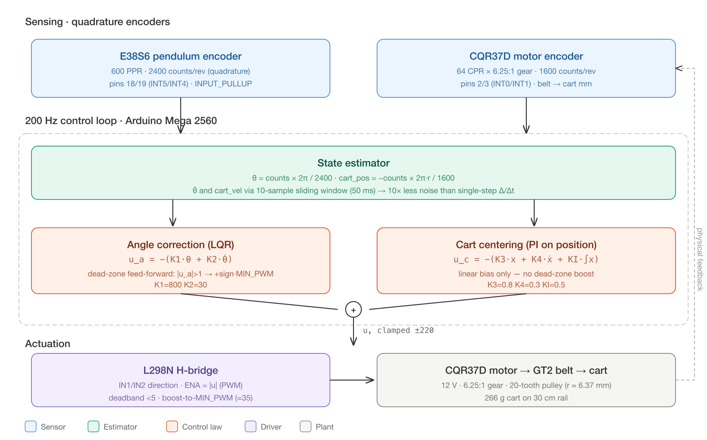

# Inverted Pendulum — LQR Balance Controller

[](https://store.arduino.cc/products/arduino-mega-2560-rev3)
[](https://platformio.org/)
[](#control-architecture)
[](#license)

A real-time inverted pendulum balance controller running on an Arduino Mega 2560. The Arduino solves the discrete-time algebraic Riccati equation (DARE) at boot to compute LQR gains from a linearized physics model and a set of cost weights, then runs the resulting state feedback at 200 Hz against quadrature encoder measurements of cart position and pendulum angle.

## Demo

https://github.com/user-attachments/assets/bd4a8e72-5cd6-4e73-9694-4a535366f85d

## Architecture



Two encoders feed a sliding-window state estimator (cart position, cart velocity, pendulum angle, angular velocity). The state is multiplied by an LQR gain vector `K` computed at boot from the linearized dynamics and a quadratic cost. The resulting command passes through a smoothly-ramped dead zone bias before being sent to an L298N H-bridge driving a geared DC motor over a GT2 timing belt.

---

## Table of contents

1. [Hardware](#hardware)
2. [The physics — equations of motion](#the-physics--equations-of-motion)
3. [Linearization around upright](#linearization-around-upright)
4. [Discretization](#discretization)
5. [LQR cost function](#lqr-cost-function)
6. [Discrete-time algebraic Riccati equation](#discrete-time-algebraic-riccati-equation)
7. [System identification](#system-identification)
8. [Why hand-overrides are needed](#why-hand-overrides-are-needed)
9. [Dead zone compensation](#dead-zone-compensation)
10. [Final gains used](#final-gains-used)
11. [Wiring](#wiring)
12. [Build & flash](#build--flash)
13. [Serial interface](#serial-interface)
14. [Tuning workflow](#tuning-workflow)
15. [Project structure](#project-structure)

---

## Hardware

| Component | Model | Notes |
|---|---|---|
| Microcontroller | Arduino Mega 2560 | 4 hardware interrupt pins for dual quadrature encoders |
| DC motor | CQR37D, 12 V, 6.25:1 gear | Hall encoder, 64 CPR → 1600 counts/rev quadrature |
| Motor driver | L298N dual H-bridge | PWM speed control, ~35 PWM static-friction floor |
| Pendulum encoder | E38S6, 600 PPR | NPN open-collector, needs `INPUT_PULLUP`, 2400 counts/rev quadrature |
| Drive | GT2 timing belt + 20-tooth pulley | r ≈ 6.37 mm, rotation → linear cart motion |
| Rail | 60 cm linear | ±300 mm physical travel; ±250 mm software limit |

### Physical parameters

| Quantity | Symbol | Value |
|---|---|---|
| Cart mass | M | 0.266 kg |
| Rod mass (uniform) | m_r | 0.024 kg |
| Top bob mass | m_b | 0.031 kg |
| Total pendulum mass | m | 0.055 kg |
| Rod length | L | 0.450 m |
| Distance pivot → COM | ℓ | 0.352 m |
| Inertia about COM | I | 0.00108 kg·m² |
| Gravity | g | 9.81 m/s² |
| Control frequency | f | 200 Hz (dt = 5 ms) |

### Computing the COM and inertia

The pendulum is a uniform rod plus a point bob at the tip. Distance from pivot to COM:

```
ℓ = (m_r · L/2 + m_b · L) / (m_r + m_b)
  = (0.024·0.225 + 0.031·0.450) / 0.055
  = 0.352 m
```

Moment of inertia about the pivot (parallel-axis form):

```
I_pivot = (1/3) m_r L²  +  m_b L²
        = 0.00162 + 0.00628
        = 0.00790 kg·m²
```

Moment of inertia about the COM (used in the linearized model):

```
I = I_pivot - m·ℓ²
  = 0.00790 - 0.055·(0.352)²
  = 0.00108 kg·m²
```

---

## The physics — equations of motion

Treat the cart-pendulum as two rigid bodies. The cart slides along a horizontal rail under a horizontal force `F`. The pendulum is a thin rod with bob, pinned to the cart, free to rotate. State: cart position `x`, pendulum angle `θ` from vertical.

Using the Lagrangian (or Newton-Euler), the nonlinear equations of motion are:

```
(M + m) ẍ + m·ℓ·θ̈·cos(θ) − m·ℓ·θ̇²·sin(θ) = F
m·ℓ·ẍ·cos(θ) + (I + m·ℓ²) θ̈ − m·g·ℓ·sin(θ) = 0
```

The first equation says: total horizontal force = cart inertia + reaction force from the pendulum's tangential and centripetal acceleration. The second says: torque balance about the pendulum's pivot, where `m·g·ℓ·sin(θ)` is the gravity-induced torque that pulls the rod *away* from upright (the unstable term).

These are coupled and nonlinear.

---

## Linearization around upright

Near the upright equilibrium (θ ≈ 0), use small-angle approximations: `sin(θ) ≈ θ`, `cos(θ) ≈ 1`, `θ̇² · sin(θ) ≈ 0`. The equations become linear in (x, ẋ, θ, θ̇):

```
(M + m) ẍ + m·ℓ·θ̈ = F
m·ℓ·ẍ + (I + m·ℓ²) θ̈ − m·g·ℓ·θ = 0
```

Solve for `ẍ` and `θ̈`. Let `p = I·(M + m) + M·m·ℓ²` (a useful determinant-like quantity). Then:

```
ẍ = ( m²·g·ℓ²/p ) θ  +  ( (I + m·ℓ²)/p ) F
θ̈ = ( m·g·ℓ·(M + m)/p ) θ  +  ( m·ℓ/p ) F
```

State vector `x = [x, ẋ, θ, θ̇]ᵀ`. In matrix form `ẋ = A_c·x + B_c·F`:

```
        ⎡ 0  1                0                          0 ⎤
A_c =   ⎢ 0  0    m²·g·ℓ² / p                            0 ⎥
        ⎢ 0  0                0                          1 ⎥
        ⎣ 0  0    m·g·ℓ·(M+m) / p                        0 ⎦

        ⎡ 0                ⎤
B_c =   ⎢ (I + m·ℓ²) / p   ⎥
        ⎢ 0                ⎥
        ⎣ m·ℓ / p          ⎦
```

This is the linearized continuous-time model. `A_c` is `4×4`, `B_c` is `4×1`.

### Plugging in numbers

```
p = I·(M+m) + M·m·ℓ²
  = 0.00108·0.321 + 0.266·0.055·0.352²
  = 0.000347 + 0.001813
  = 0.002160 kg·m²

A_c[1][2] = m²·g·ℓ² / p = (0.055² · 9.81 · 0.352²) / 0.00216  = 1.717
A_c[3][2] = m·g·ℓ·(M+m) / p = (0.055·9.81·0.352·0.321) / 0.00216 = 28.18

B_c[1] = (I + m·ℓ²) / p = (0.00108 + 0.00682) / 0.00216 = 3.66 m/(N·s²)
B_c[3] = m·ℓ / p        = (0.055·0.352) / 0.00216         = 8.96 rad/(N·s²)
```

### Open-loop natural frequency (how fast it falls)

The unstable eigenvalue of `A_c` near upright is `+ω` where:

```
ω = √( m·g·ℓ·(M+m) / p ) = √28.18 ≈ 5.31 rad/s
τ_fall = 1/ω ≈ 188 ms
```

Compare to the original 24g uniform rod (no bob): `τ ≈ 175 ms`. Adding the 31g top bob increased τ by ~7%, slowing the fall and giving the controller more reaction time.

### From force `F` to PWM command `u`

The Arduino doesn't command Newtons — it commands PWM counts. We approximate `F = α · u` where `α = INPUT_GAIN_N_PER_PWM`. So the actual `B` matrix used by the LQR is:

```
B = α · B_c
```

`α` is the hardest parameter to know exactly because it depends on motor torque, gearing, belt, and friction. We measure it experimentally — see [System identification](#system-identification).

---

## Discretization

The control runs at 200 Hz, so the LQR is computed for the discrete-time system using a forward-Euler approximation:

```
A_d = I + A_c · dt
B_d = α · B_c · dt          (dt = 5 ms)
```

This is good enough at 200 Hz because the pendulum's natural frequency (~5 rad/s ≈ 0.8 Hz) is far below the Nyquist rate.

---

## LQR cost function

LQR finds the gain `K` that minimizes the infinite-horizon quadratic cost:

```
       ∞
J  =   ∑   ( xₖᵀ · Q · xₖ  +  uₖᵀ · R · uₖ )
      k=0
```

Here `Q` weights state errors and `R` penalizes control effort. The optimal control law is **linear state feedback**:

```
uₖ = −K · xₖ
```

Where `K` is a `1×4` row vector.

### Cost weights used

```
Q = diag( Q_X,  Q_XDOT,  Q_THETA,  Q_THETADOT )
  = diag( 3000,  100,    8000,     20 )

R = R_INPUT = 0.10
```

Intuition for each weight:

| Weight | What it penalizes | Value | Why |
|---|---|---|---|
| Q_X | Cart position error | 3000 | High — drift away from center is costly |
| Q_XDOT | Cart velocity | 100 | Medium — moderate damping on cart |
| Q_THETA | Angle error | 8000 | Highest — falling is catastrophic |
| Q_THETADOT | Angular velocity | 20 | Low — let the pendulum swing through small motions, don't over-damp |
| R | Control effort | 0.10 | Low — control is "cheap", be aggressive |

---

## Discrete-time algebraic Riccati equation

LQR for the discrete system reduces to solving the DARE for a positive-definite matrix `P`:

```
P = AᵀPA  −  AᵀPB · (R + BᵀPB)⁻¹ · BᵀPA  +  Q
```

Then the gain is:

```
K = (R + BᵀPB)⁻¹ · BᵀPA
```

We solve the DARE on the Arduino at boot using fixed-point Riccati iteration, starting from `P₀ = Q`:

```
repeat until ‖P_{n+1} − P_n‖∞ < tol:
    PA   = P · A
    AᵀPA = Aᵀ · P · A
    PB   = P · B            (vector)
    S    = R + BᵀPB         (scalar, since u is scalar)
    BᵀPA = Bᵀ · P · A       (row vector)
    P_{n+1} = AᵀPA − (AᵀPB) · (1/S) · (BᵀPA) + Q
```

After convergence:

```
K = (1/S) · (BᵀPA)
```

The implementation lives in `compute_lqr_gain()` in `src/main.cpp`. It uses 4×4 dense matrices, runs in ≤200 iterations with `tol = 1e−4`, and finishes in well under a second on the ATmega2560.

---

## System identification

The LQR model needs `α = INPUT_GAIN_N_PER_PWM`. We measured it experimentally with the `a` command, which pulses the motor at full PWM (255) and logs cart position every 5 ms.

### Cart acceleration test (PWM = 255)

| time (ms) | position (mm) | velocity (mm/s) |
|---|---|---|
| 5 | 0.08 | 15 |
| 25 | 1.68 | 105 |
| 50 | 5.85 | 200 |
| 100 | 18.61 | 285 |
| 145 | 32.12 | 310 |

**Peak cart acceleration** (early phase, before friction dominates): ~3.0 m/s²
**Terminal velocity at PWM 255**: ~310 mm/s (friction-limited)

Using `F = m_total · a`:

```
F_peak = (M + m) · a_peak  =  0.321 · 3.0  =  0.96 N at u = 255
α      = F_peak / 255       ≈ 0.0038 N/PWM
```

After tuning we use **α = 0.008 N/PWM** in the model — slightly higher than the raw measurement because `α = 0.0038` is the *peak* acceleration. The effective average force during balancing is somewhere between peak and terminal-velocity-equivalent. `α = 0.008` gives a model that produces gains in the right ballpark.

### Required cart acceleration to recover an angle

Physics: to recover a tilted pendulum, the cart's horizontal acceleration must exceed `g · tan(θ)`:

| Angle θ | Required cart accel |
|---|---|
| 5° | 0.86 m/s² |
| 10° | 1.73 m/s² |
| 17° | **3.00 m/s² (our limit)** |
| 20° | 3.57 m/s² (impossible) |

So the cart can in principle recover up to ~17°. In practice, dynamics, lag and noise mean the controller starts losing authority around 10°.

---

## Why hand-overrides are needed

The DARE solver gives mathematically optimal gains *for its model*. But the model is only an approximation, so the resulting `K` doesn't always work well in practice. After several test runs the following deltas were applied in `setup()`:

```c
K[0] *= 8.0f;     // cart position: 8x stronger
K[1] *= 5.0f;     // cart velocity: 5x stronger
if (K[3] > 60.0f) K[3] = 60.0f;   // cap angular velocity gain
```

**Why scale up K_x and K_x_dot.** The DARE result gives a cart-position gain of ~−100. At 76 mm of cart drift, the cart-correction contribution to the command is only about 8 PWM — far too weak to bring the cart back. The 8× scaling restores the cart-correction authority to roughly what a hand-tuned controller produces (~800 PWM/m).

**Why cap K_theta_dot.** The DARE solver insists on K_theta_dot ≈ 200 because its model assumes the system has *no passive damping*. The real system has friction, gear backlash, and belt elasticity — plenty of natural damping. With K_theta_dot = 200, every small change in angular velocity produces a large change in motor command, causing the cart to vibrate back and forth and the pendulum to fall from the vibration itself. Capping K_theta_dot at 60 lets the pendulum swing smoothly through small motions while still providing real damping at large angular velocities.

---

## Dead zone compensation

The L298N + DC motor combo has a static-friction band: PWM commands below ~35 produce no movement at all. Without compensation, the controller's small corrections vanish and it can't do fine cart-centering.

The fix is a **smooth additive bias**, not a hard clamp:

```
For 0 < |cmd| ≤ 40:    bias = MIN_PWM · (|cmd| / 40)     (linear ramp)
For |cmd| > 40:        bias = MIN_PWM                    (full bias)

output = cmd + sign(cmd) · bias
```

The ramp avoids the discontinuity at zero that caused jitter in earlier versions. Small commands get a small bias, big commands get the full MIN_PWM kick.

| LQR command | Without bias | Old hard-clamp | New smooth ramp |
|---|---|---|---|
| 5 | 5 (lost) | 35 (sudden jump) | **9** (smooth) |
| 20 | 20 (weak) | 35 (sudden jump) | **38** |
| 40 | 40 | 40 | **75** |
| 100 | 100 | 100 | **135** |

---

## Final gains used

After DARE solve + manual overrides, the actual gain vector applied at runtime is:

```
K = [ −807, −464, 1129, 60 ]
```

Mapped back to physical units and meaning:

| Index | Gain | State | Effect |
|---|---|---|---|
| K[0] | −807 | cart_pos (m)        | "If cart is +1 m off-center, contribute −807 PWM" |
| K[1] | −464 | cart_vel (m/s)      | "If cart is moving +1 m/s, contribute −464 PWM" |
| K[2] | +1129 | theta (rad)        | "If pendulum is +1 rad tilted, contribute −1129 PWM" |
| K[3] | +60  | theta_dot (rad/s)   | "If pendulum is rotating +1 rad/s, contribute −60 PWM" |

(Final command is `u = −K · x`, then dead-zone bias and saturation at ±255.)

---

## Wiring

```
CQR37D Motor Encoder        Arduino Mega
  Yellow (A) ─────────────── Pin 2  (INT0)
  White  (B) ─────────────── Pin 3  (INT1)
  Blue   (VCC) ───────────── 3.3 V
  Gray   (GND) ───────────── GND

E38S6 Pendulum Encoder      Arduino Mega
  Green  (A) ─────────────── Pin 18 (INT5)
  White  (B) ─────────────── Pin 19 (INT4)
  VCC ────────────────────── 5 V
  GND ────────────────────── GND

L298N Motor Driver          Arduino Mega
  IN1 ────────────────────── Pin 8
  IN2 ────────────────────── Pin 9
  ENA ────────────────────── Pin 10 (PWM)
  Motor + ────────────────── Cart motor terminal A
  Motor − ────────────────── Cart motor terminal B
  VCC (12 V) ─────────────── External 12 V supply
  GND ────────────────────── External supply GND + Arduino GND
```

---

## Build & flash

Requires [PlatformIO](https://platformio.org/).

```bash
pio run              # build
pio run -t upload    # flash
pio device monitor   # serial monitor (115200 baud)
```

---

## Serial interface

| Key | Action |
|---|---|
| `s` | Start balancing (hold pendulum upright first, then release) |
| `x` | Emergency stop |
| `r` | Reset encoders to zero |
| `d` | Toggle diagnostic mode (raw encoder counts + pin states) |
| `t` | Tilt test — pure-P control to verify motor direction |
| `m` | Motor test (forward/reverse at PWM 60) |
| `a` | Cart acceleration test (full PWM, logs position every 5 ms) |
| `p` | Print current K gain vector |

In balance mode the firmware streams tab-separated telemetry at 50 Hz suitable for the Arduino Serial Plotter:

```
theta(deg)    theta_dot(rad/s)    cart_pos(mm)    cart_vel(mm/s)    motor_cmd(PWM)
```

---

## Tuning workflow

1. **Verify encoders** (`d`). Rotate each encoder by hand and confirm both counts move and pin states toggle.
2. **Tilt test** (`t`). Tilt the pendulum slowly by hand; the motor should push the cart **toward** the tilt. If it pushes away, flip `MOTOR_DIR` to `-1`.
3. **Acceleration test** (`a`). Run with cart centered. Read off peak cart velocity and position vs time. Compute `α ≈ (M+m)·a_peak / 255`.
4. **Set `INPUT_GAIN_N_PER_PWM`** in the source to roughly 2× the raw `α` measurement to account for friction.
5. **Set Q and R**. Reasonable starting points: `Q_THETA = 8000`, `Q_THETADOT = 20`, `Q_X = 3000`, `Q_XDOT = 100`, `R = 0.10`.
6. **Build, flash, observe printed K**. Sanity check that `K_theta` is in the hundreds and `K_theta_dot` is < 100.
7. **Apply hand-overrides** in `setup()`. Scale `K[0]` and `K[1]` if cart correction is too weak. Cap `K[3]` if you see vibration.
8. **Iterate.** Hold the pendulum upright, send `s`, release. Watch the telemetry. If the angle is held but the cart drifts, increase `K[0]` scaling. If the pendulum vibrates, lower the `K[3]` cap.

---

## Project structure

```
src/
  main.cpp          # full system: pins, model, DARE solver,
                    #              motor driver, state machine, serial CLI
platformio.ini      # Arduino Mega 2560, paulstoffregen/Encoder
architecture.png    # control architecture diagram
architecture.svg    # editable source for the diagram
README.md           # this document
```

---

## License

MIT.
